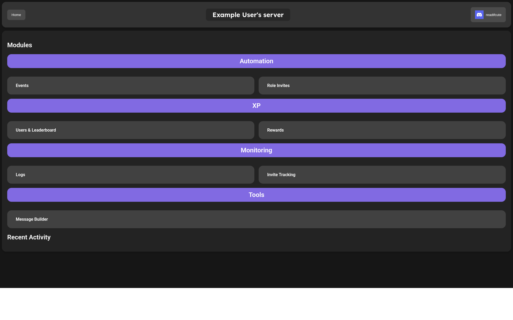

The DaalBot Dashboard is your central hub for managing DaalBot in your server. It provides a user-friendly interface to monitor and control various aspects of the bot's operation.

## Finding the Dashboard
You can either directly access the dashboard via [dashboard.daalbot.xyz](https://dashboard.daalbot.xyz). If you had followed the getting started guide, it should've automatically redirected you to the dashboard after inviting the bot. Alternatively, you can access the dashboard through the DaalBot website by clicking on the "Dashboard" link in the top navigation bar.

## Locating Your Server
After logging in with your Discord account, you'll be taken to the main dashboard page. Once you're on the dashboard, you'll see a list of servers where you have permission to manage DaalBot (Manage Server permission). Click on the server you want to manage to access its specific dashboard.

### Not Seeing Your Server?
If you don't see your server listed, or don't see any servers at all, try the following steps:

#### Check Permissions
Ensure you have the "Manage Server" permission in the server you want to manage.

#### Wait
We may cache server data for up to an hour, so if you have recently accessed the dashboard before gaining the necessary permissions, it may take some time for the server to appear. If you really don't want to wait, please follow the following step.

#### Reauthorize DaalBot
In the event that the above steps don't resolve the issue, you can try reauthorizing DaalBot. To do this, head to the [main dashboard page](https://dashboard.daalbot.xyz) and click on your username and avatar in the top right corner (Or hit "Toggle Menu" on mobile). From the newly appeared options, select "Logout". After logging out, you'll be redirected through a couple pages before being logged back in. This process will refresh any locally stored data and should solve any failing requests.

## Server Dashboard Overview
Once you've selected your server, you'll be taken to its dashboard page, it'll look something like this:
