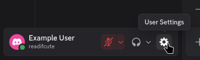
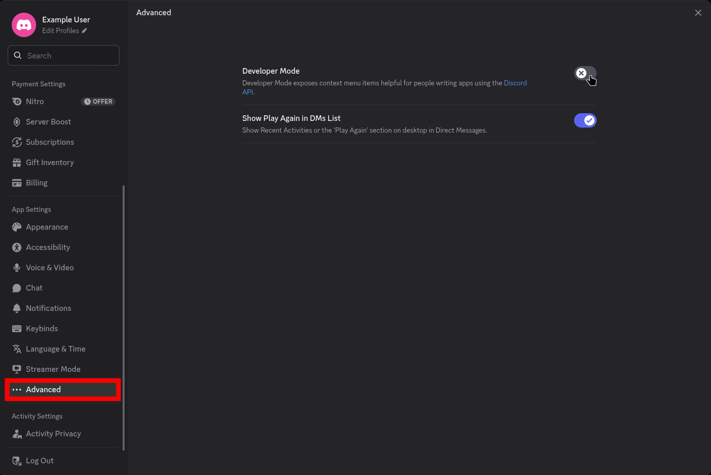
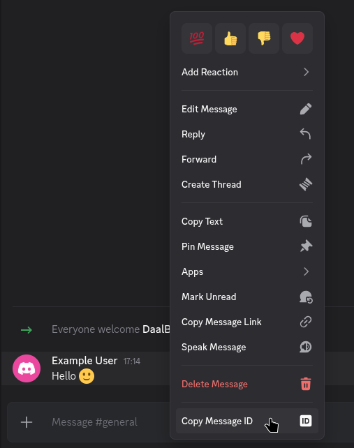
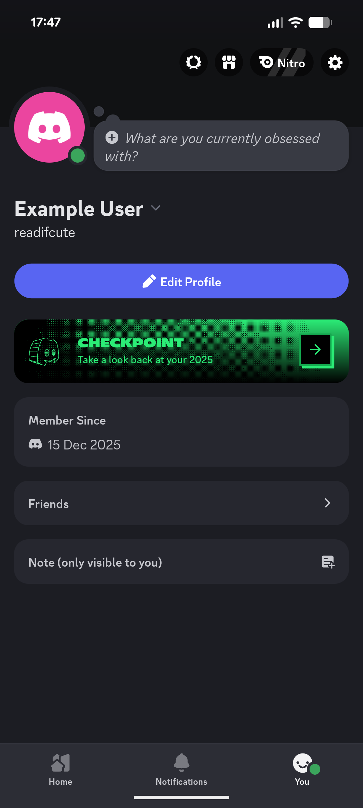
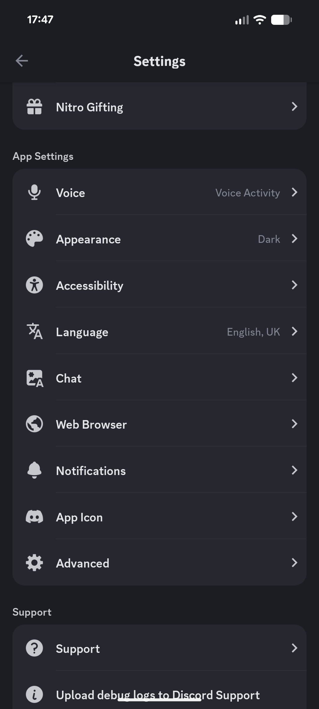
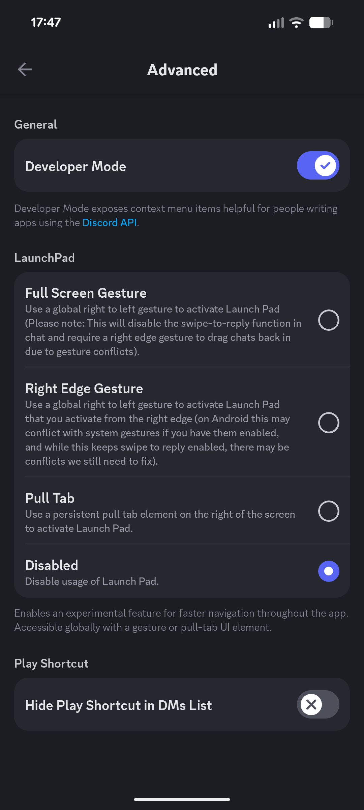

Message IDs are unique identifiers for messages in the chat. Although most places that accept a message ID will also accept a message link, it's still useful to know how to get a message ID.

# Enabling Developer Mode (Platform Specific)
The method for enabling Developer Mode is slightly different depending on whether you are using the desktop app or the mobile app.

## Desktop
First you need to go into your user settings by clicking the gear icon in the bottom left of Discord.

Next, navigate to the Advanced tab in the settings sidebar and enable Developer Mode by clicking the toggle.

After enabling Developer Mode, you can simply right-click on any message and select `Copy Message ID` to copy the message ID to your clipboard.

## Mobile
To enable Developer Mode on mobile, first open the Discord app and tap on your profile picture in the bottom right before tapping on the settings gear icon in the top right.

Next, scroll down to the `App Settings` section and tap on `Advanced`.

Finally, enable Developer Mode by tapping the toggle switch next to it.

After enabling Developer Mode, you can long press on any message and select `Copy Message ID` to copy the message ID to your clipboard.

# Universal Methods
If you do not want to enable Developer Mode, there are still ways to get message IDs.

## Using Message Links
Within DaalBot, you can also use message links in place of message IDs. To get a message link, right click on the message (or long press on mobile) and select `Copy Message Link`. If you want to manually extract the message ID from a message link, it is the last set of numbers in the link. For example, in the link `https://discord.com/channels/1234/5678/9012`, the message ID is `9012`. (Do note that real message links will have way longer numbers.)

## Using Bots
Using either a user installed app or a bot within the server, there could be a button available to get message IDs. For example, [Candy](https://candy.piny.dev) (a discord bot mostly focused on fun but with some utility features) has a context menu button to show message details, including the message ID.
To use this feature, right click on a message (or long press on mobile) and hover over (tap on mobile) `Apps` and then select `Details` from the submenu. This will send a message in the chat that only you can see with the message details, including the message ID.